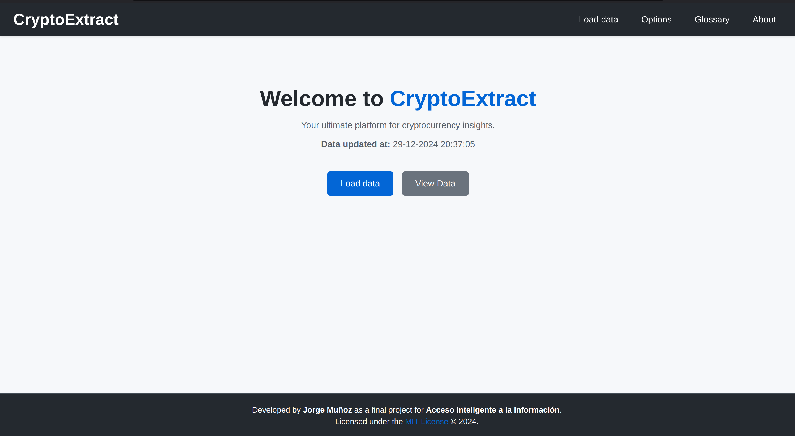
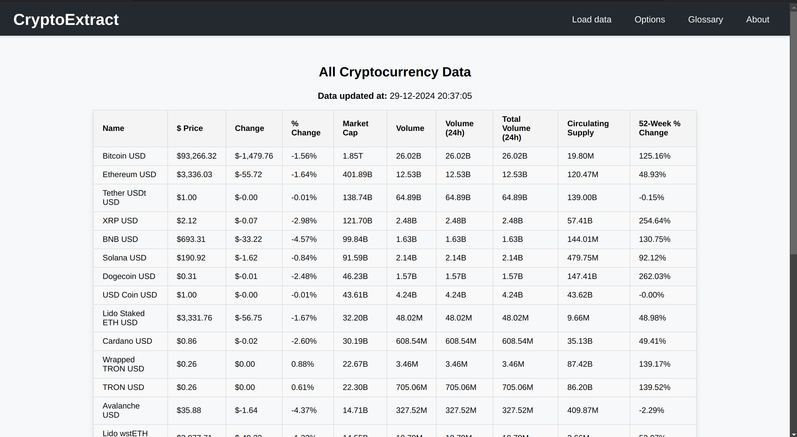
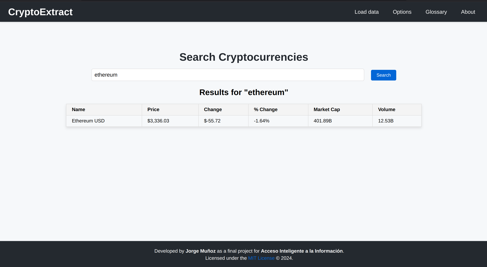
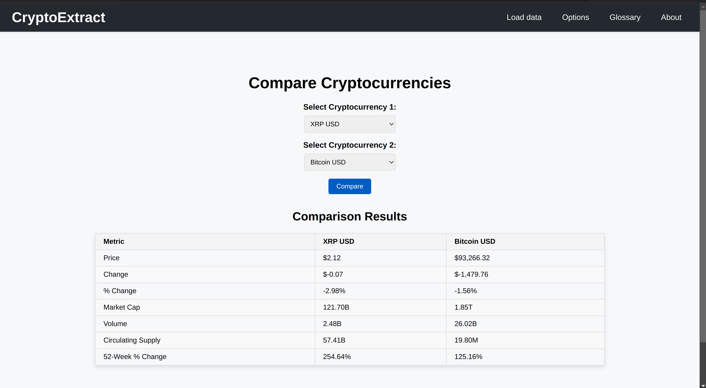
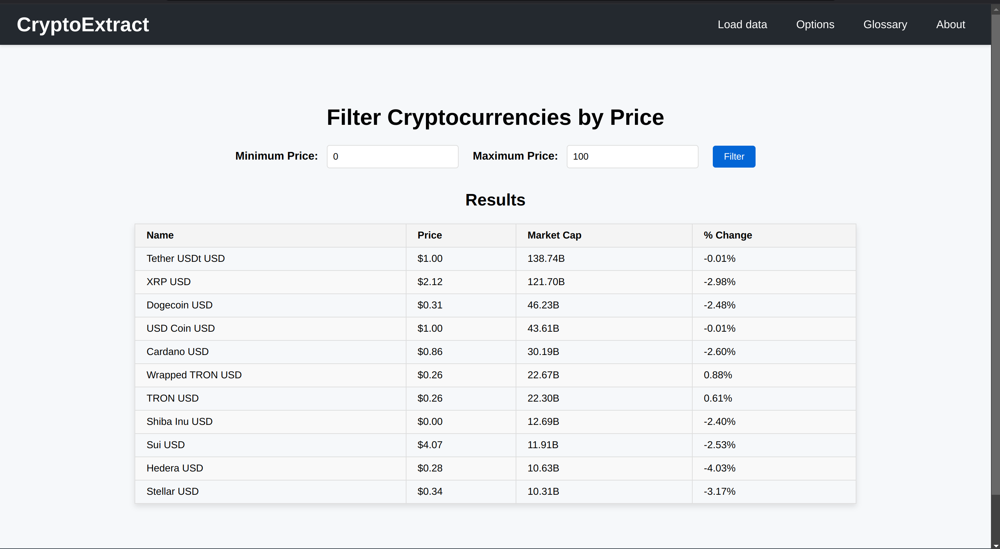
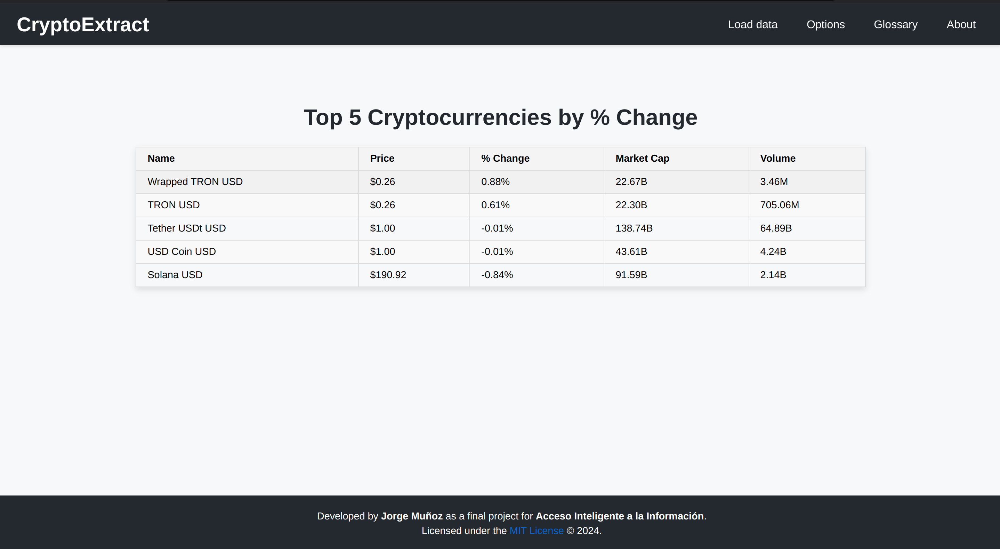
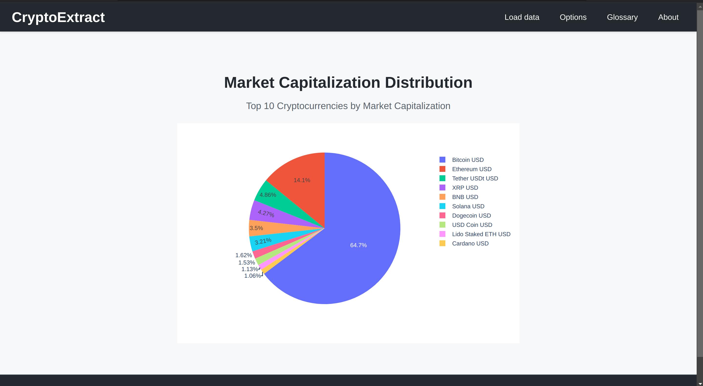
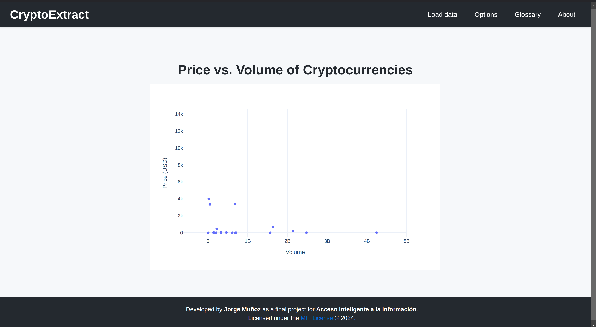

# CryptoExtract

CryptoExtract is a web application designed as a final project for the course **Acceso Inteligente a la Información**. The application provides tools to scrape, index, and analyze cryptocurrency data fetched in real-time from [Yahoo Finance](https://finance.yahoo.com/markets/crypto/all/).

## Features

### Core Functionalities
- **Home Page**: Overview of the project and the last data update timestamp.
- **Load Data**: Fetches the latest cryptocurrency data from Yahoo Finance and indexes it.
- **List All Data**: Displays all indexed cryptocurrencies in a sortable and scrollable table.
- **Search Cryptocurrencies**: Search for cryptocurrencies by name using a robust search engine.
- **Top 5 by Percentage Change**: Displays the top 5 cryptocurrencies with the highest percentage change in the last 24 hours.
- **Price Range Filter**: Allows users to filter cryptocurrencies by specifying a price range.
- **Scatter Plot (Price vs. Volume)**: Visualizes the relationship between cryptocurrency prices and trading volume using an interactive chart.
- **Market Cap Chart**: A bar chart comparing the market capitalization of cryptocurrencies.
- **Compare Cryptocurrencies**: Compare two selected cryptocurrencies side by side.
- **Glossary**: A detailed glossary explaining key cryptocurrency-related terms.

## Technology Stack

### Backend
- **Django**: The primary web framework.
- **Whoosh**: Used for indexing and searching cryptocurrency data.
- **BeautifulSoup**: For web scraping cryptocurrency data from Yahoo Finance.

### Frontend
- **HTML/CSS**: For structuring and styling pages.
- **JavaScript**: For interactivity, including confirmation modals and dropdown menus.
- **Plotly**: For creating interactive data visualizations.

### Others
- **Python**: The core language used for the backend.

## Setup Instructions

### Prerequisites
- Python 3.8 or higher
- `pip` for installing Python packages

### Installation

1. Clone the repository:
   ```bash
   git clone https://github.com/jormunrod/CryptoExtract.git
   cd cryptoextract
   ```

2. Create a virtual environment:
   ```bash
   python -m venv venv
   source venv/bin/activate
   ```

3. Install dependencies:
   ```bash
   pip install -r requirements.txt
   ```

4. Apply migrations:
   ```bash
   python manage.py migrate
   ```

5. Start the development server:
   ```bash
   python manage.py runserver
   ```

6. Open your browser and navigate to `http://127.0.0.1:8000`.

### Fetching Data
- Click on the "Load Data" button in the application to scrape and index the latest cryptocurrency data.

## Project Structure

```
cryptoextract/
│
├── core/
│   ├── templates/core/
│   ├── static/core/
│   └── ...
├── scraper/
│   ├── templates/scraper/
│   ├── whoosh_utils.py
│   ├── utils.py
│   └── ...
├── crypto_index/
│   ├── _MAIN_1.toc
│   ├── _MAIN_WRITELOCK
│   ├── ...
├── last_updated.txt
├── manage.py
└── requirements.txt
```

## Screenshots

### Home Page


### List All Data


### Search Cryptocurrencies


### Comparison View


### Filter by Price Range


### Top 5 by Percentage Change


### Market Cap Chart


### Scatter Plot (Price vs. Volume)


## License

CryptoExtract is licensed under the [MIT License](https://opensource.org/licenses/MIT). 

## Developed By
This project was developed by **Jorge Muñoz Rodríguez** as part of the course **Acceso Inteligente a la Información**.

---

Enjoy using CryptoExtract! 🚀

